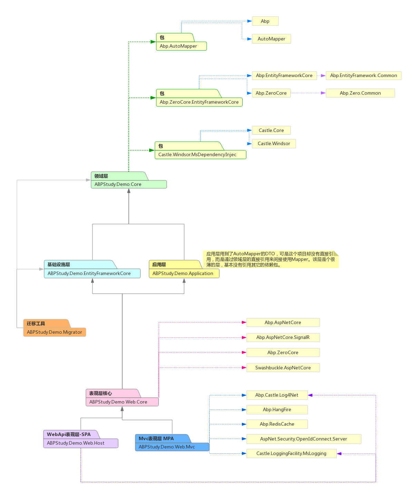

# ABP项目学习与研究的快速实践

##  下载与安装
 1. 从模板开始，不必完全从头构建。[Start with ASP.NET Boilerplate using free or premium startup templates.](https://aspnetboilerplate.com/Templates)                
 1. 为了分布式跨平台考虑，使用.net Core2 采用多页面方式，输入项目名称：ABPStudy.Demo 然后点击开始创建我的项目。
 1. 完成创建后会进入创建与下载页面。并且有[开发文档链接，通过这个学习后续的内容](https://aspnetboilerplate.com/Pages/Documents/Zero/Startup-Template-Core)

## 项目启始化与运行
1. 用 Visual Studio 2017 v15.3.5+ 打开，并且选择Build
1. 选择 ``Web.Mvc`` 做为启动项目，appsettings.json中有Db连接，如果有需要可以自已修改。 注意：``Web.Host``、``Migrator`` 中都有Db连接串，要一起修改。 
1. VS中选择工具-> Nuget管理 -> 程序包管理器控制台，确保选中默认项目为：``.EntityFrameworkCore``。然后输入： ``Update-Database`` ，将迁移信息写入Db中。
1. 运行项目``Web.Mvc``，即可查看结果了。
1. 默认的用户名和密码是：'`admin`'   '`123qwe`' 。 

## 注意
1. 选中``.EntityFrameworkCore`` 生成Db的时候，是以MVC项目下的配置来连接Db的

## Abp项目层次与依赖图

## 定制化
1. 使用NLog日志模块来代替log4net

